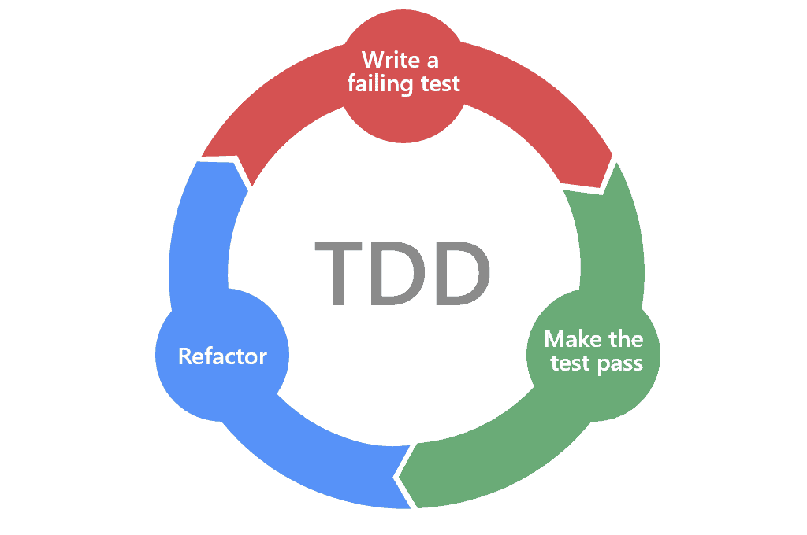
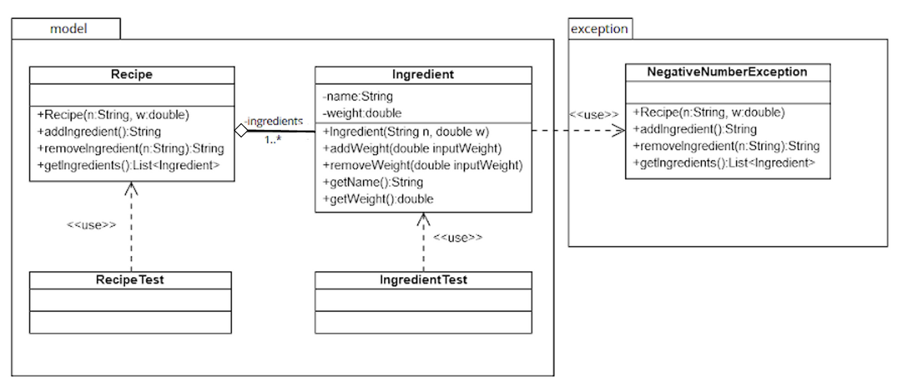

# Workshop 2024-1 - Unit Testing

[](https://github.com/APO-2/seguimiento-testing-Arkantrust/actions/workflows/maven.yml)

**Algoritmos y Programación II**

**School of Engineering, Design and Applied Sciences**

[](https://classroom.github.com/a/V0FNL7NV)

## Summary

A reknown restaurant has requested the construction of a sophisticated software system to keep track of the recipes of its chefs.

The program consists of building recipes from a list of ingredients. For this, the basic functions are:

- Create an ingredient
- increase weight to the ingredient
- decrease weight to the ingredient
- add an ingredient to the recipe
- remove an ingredient from the recipe

The development has been started by designing initial unit tests following TDD practices (see TDD schema below). Now it is your task to implement the stages, test cases and development.


Ilustration 1 - TDD Schema



You must implement the unit tests defined in the previous model using JUnit.

## Staging Setup

| **Name** | **Class** | **Stage** |
| --- | --- | --- |
| `setupStage1` | `IngredientTest` | An instance of the Ingredient class with `name="Tomato"` and `weight=245` |
| `setupStage1` | `RecipeTest` | An instance of the Recipe class **without any ingredients** |
| `setupStage2` | `RecipeTest` | An instance of the Recipe class with 3 ingredients (mentioned below) |

### Igredients for `setupStage2`:

``` json
{ name="Onion", weight=300 },
{ name="Garlic", weight=100 },
{ name="Rice", weight=500 }
```

## Test Case Design

1. Objective: Verify that the methods `addWeight` and `removeWeight` of the `Ingredient` class work as expected editing the weight of the existing ingredient.

| **Class** | **Method** | **Stage** | **Input** | **Expected Output** | ** Passed **
| --- | --- | --- | --- | --- | --- |
| `Ingredient` | `addWeight` | `setupStage1` | `weight=54` | Ingredient's weight is now 299 | [  ] |
| `Ingredient` | `addWeight` | `setupStage1` | `weight=-100` | Ingredient's weight is still 245. Throws an exception and a message stating that negative numbers can't be used. | [  ] |
| `Ingredient` | `removeWeight` | `setupStage1` | `weight=45` | Ingredient's weight is now 200 | [  ] |
| `Ingredient` | `removeWeight` | `setupStage1` | `weight=-100` | Ingredient's weight is still 245. Throws an exception and a message stating that negative numbers can't be used. | [  ] |

2. Objective: Verify that the method `addIngredient` of the `Recipe` class correctly adds a new ingrediente when the ingredient is new (there is no ingredient with that name), and when the ingredient already exists, in which case a new ingredient will not be added, only the weight of the existing ingredient will be updated.


| **Class** | **Method** | **Stage** | **Input** | **Expected Output** | **Passed** |
| --- | --- | --- | --- | --- | --- |
| `Recipe` | `addIngredient` | `setupStage1` | `n="Salt", w=12` | Recipe now has 1 ingredient named salt with weight 12 | [  ] |
| `Recipe` | `addIngredient` | `setupStage2` | `n="Pepper", w=6` | Recipe now has 4 ingredients, the last one is called Pepper and weighs 6 | [  ] |
| `Recipe` | `addIngredient` | `setupStage2` | `n="Garlic", w=21` | Recipe still has 3 ingredients but the one called Garlic now weighs 79 | [  ] |
| `Recipe` | `removeIngredient` | `setupStage2` | `n="Garlic"` | Recipe now has 2 ingredients: Onion and Rice | [  ] |

Run the tests and check the code works accordingly.

[Original Instructions Document](https://docs.google.com/document/d/11ciAtZHVDO6Iw0PSi_bytWbnl1RAmqKUoU2_bHp-T1A/edit?usp=sharing)